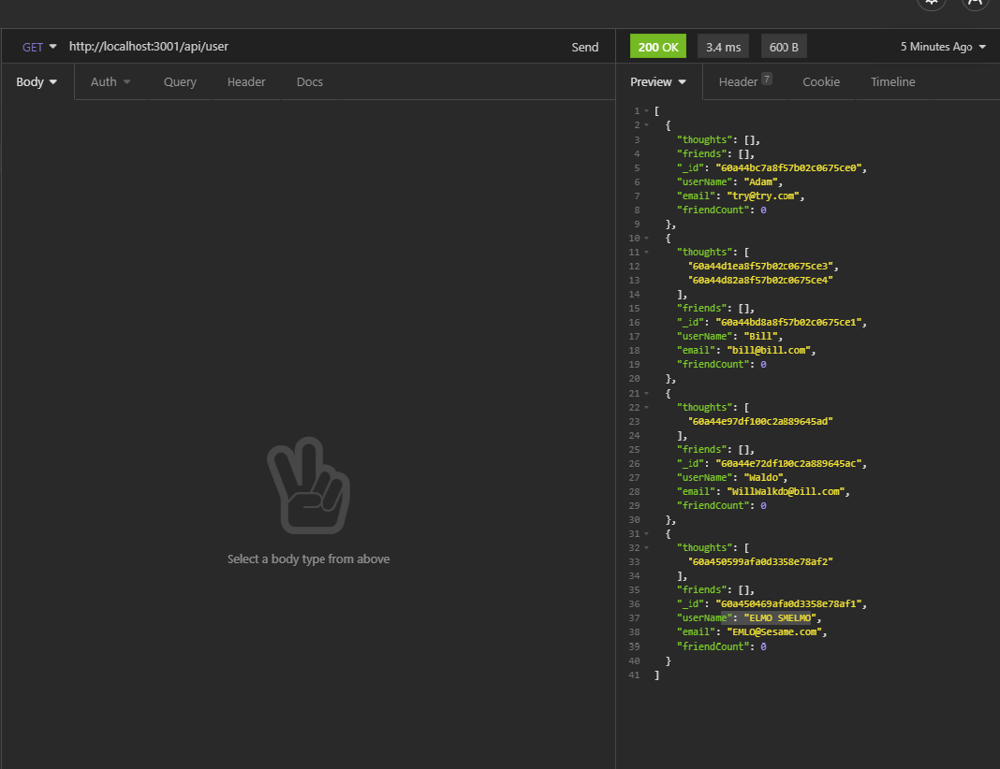

# hive-minded

## License

## Table of Contents

 * [Installation](#installation)
 * [Usage](#usage)
 * [Credits](#credits)
 * [License](#license)
 
## Description

<a href="https://drive.google.com/file/d/1pm_ONKu7hk-mWeH7Dt3djBAGYRrbGGI1/view" target="_blank">CLICK TO VIEW IT IN ACTION</a>

Its back end for a social media site

## Usage

node server will start the server. Then you can make CRUD commands to it through Insomnia.

## Installation

>npm i

## Languages

JavaScript ,Node 

## Questions

### AdamR-Work

https://github.com/AdamR-Work/hive-minded

## Contributing

## Tests

>no

## Credits

